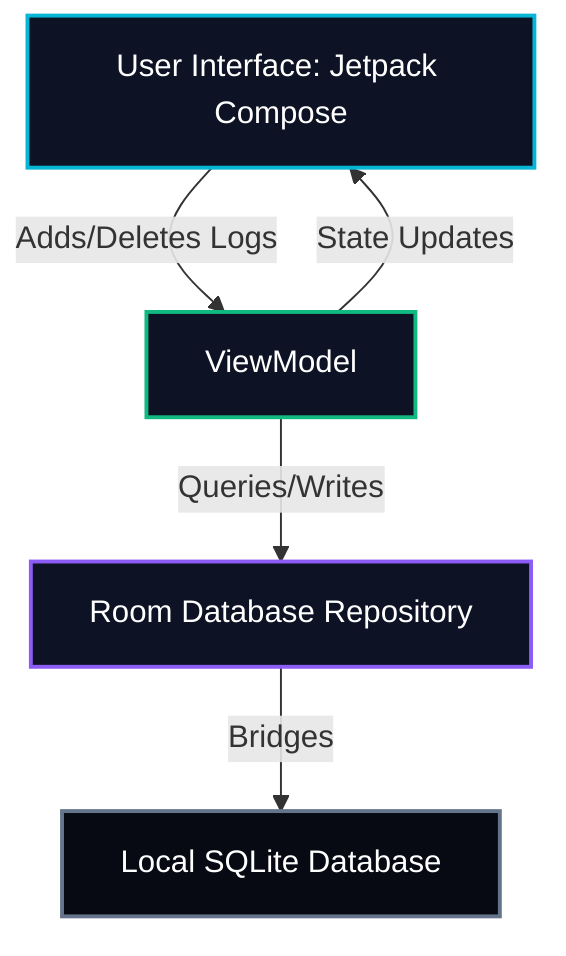

# Buckspense - Android App MVP Specification & Roadmap

Welcome to the architectural specifications and development roadmap for the **Buckspense** Android application! 

This guide is designed explicitly to help a beginner navigate building an offline-first financial tracker, using a modern tech stack (Kotlin, Jetpack Compose, and Room SQLite) paired with AI development assistance in Android Studio.

---

## 🎯 MVP Goals & Architecture

* **Product Name**: Buckspense
* **Core Value Proposition**: 100% offline, privacy-first, secure, zero cloud synchronization, ad-free personal financial tracking.
* **Storage Model**: Local-only device sandbox using a Room SQLite database.
* **Target OS Version**: Android 8.0 (API 26) and above.

---

## 🛠️ The Modern Android Tech Stack (Recommended)

To build a high-quality application with the minimum amount of complex boilerplate code, you should use the following stack:

1. **Language**: **Kotlin** (Modern, type-safe, expressive, and official language for Android).
2. **UI Framework**: **Jetpack Compose** (Declarative UI framework. Much simpler to learn and write compared to older XML layouts).
3. **Local Database**: **Room Database** (Official SQLite object-mapping library. Eliminates raw SQL string bugs and integrates directly with modern Kotlin architecture).
4. **State Management**: **ViewModel + StateFlow** (Separates UI views from data processing logic to prevent data loss on screen rotation).

---

## 🗄️ Database Schema Blueprint (Room SQLite)

You will need a clean local ledger database to record expenses. Here are the core database entities you should create:

### 1. Transaction Table (`expense_table`)
| Column Name | Data Type | Key Type | Description |
| :--- | :--- | :--- | :--- |
| `id` | `Long` | Primary Key (Autoincrement) | Unique identifier for the transaction. |
| `amount` | `Double` | - | Monetary value of the log (e.g. `12.50`). |
| `category` | `String` | - | Tag group (e.g., "Food", "Transit", "Entertainment"). |
| `timestamp` | `Long` | - | Date/time stored as Unix epoch milliseconds. |
| `note` | `String` | - | Optional brief description (e.g., "Grocery grocery store"). |

### 2. Category Defaults
You should pre-populate or hardcode a simple selection of categories to keep the MVP lightweight:
* 🍔 **Food &amp; Dining**
* 🚌 **Transit &amp; Travel**
* 🏠 **Housing &amp; Rent**
* 🎬 **Entertainment**
* 🛍️ **Shopping**
* 💡 **Bills &amp; Utilities**
* ➕ **Other Expenses**

---

## 📱 User Stories & Screen Flows

### Story 1: Dashboard Home Screen
* **User Goal**: View monthly spending vs. budget limit at a single glance.
* **Layout Elements**:
  * **Circular or Horizontal Progress Bar**: Displays `Total Monthly Spending` / `Budget Limit` (e.g., `$480.00 / $800.00`) and lights up yellow/red when exceeding limits.
  * **Quick Filter**: Tabs to toggle between daily, weekly, and monthly summaries.
  * **Recent Logs Feed**: A scrollable vertical list showing the last 5 logs.
  * **Floating Action Button (FAB)**: A green `+` circle at the bottom right to trigger a new log input.

### Story 2: Transaction Logger Form
* **User Goal**: Quickly enter an expense.
* **Layout Elements**:
  * **Numeric Input Field**: Optimized for decimal numbers (triggers numerical keyboard).
  * **Category Selector**: Horizontal scroll chips or grid icons.
  * **Note text box**: Short string text input.
  * **Save Button**: Validates amount is greater than zero, inserts to Room DB, and closes form.

---

## 🤖 AI Prompt Guide for Android Studio & Chat Agents

Since you are a beginner, you can use these exact prompts in your Android Studio AI sidebar or chat helper to generate the clean code blocks step-by-step:

### Step 1: Database Setup
> **Prompt**:
> *"I am a beginner building an offline-first Android app called 'Buckspense' in Kotlin. Please write a Room database entity called `Expense` and a DAO interface called `ExpenseDao` with methods to insert, delete, and fetch all expenses sorted by timestamp. Provide all the import statements and explain where to place the files in my Android Studio project."*

### Step 2: ViewModel Implementation
> **Prompt**:
> *"Now that my Room database code is written, please help me write a Kotlin ViewModel called `ExpenseViewModel` that interacts with the `ExpenseDao`. The ViewModel should expose the list of expenses as a StateFlow so my Jetpack Compose UI can observe it, and include functions to add and delete expenses. Use standard coroutine scopes for database operations."*

### Step 3: Compose UI Dashboard
> **Prompt**:
> *"Please create a Jetpack Compose screen called `DashboardScreen` that shows a beautiful, glowing horizontal progress bar representing monthly budget utilization (e.g., $480 spent of $800 limit). Below the progress bar, show a scrollable list of recent expenses with custom icons for 'Food', 'Transit', 'Bills', and 'Other' categories. Make it look sleek, matching a premium dark theme."*

### Step 4: Transaction Entry Form
> **Prompt**:
> *"Please write a Jetpack Compose composable dialog or screen called `AddExpenseDialog` that prompts the user for a numeric expense amount, offers a selection of categories (Food, Transit, Rent, Bills) as click-selectable chips, and provides a text field for a short note. When the user clicks Save, validate that the amount is valid, trigger the ViewModel's insert function, and dismiss the dialog."*

---

## 📈 MVP Verification & Next Steps

When you have built the code blocks, run the app on the **Android Studio Emulator** and verify:
1. Does adding a transaction immediately update the progress bar on the Home Screen?
2. Does closing and fully restarting the app preserve the transactions? (Tests database persistence).
3. Switch your phone to Airplane Mode (Offline) and verify all logging and charts remain 100% operational.
